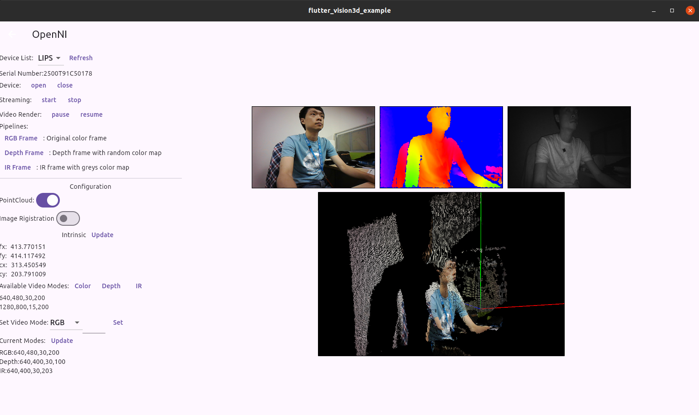
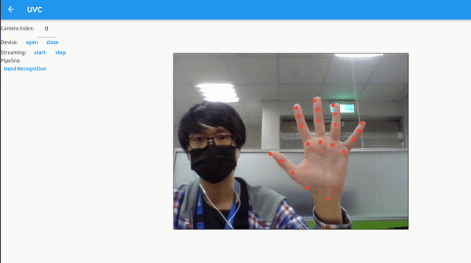
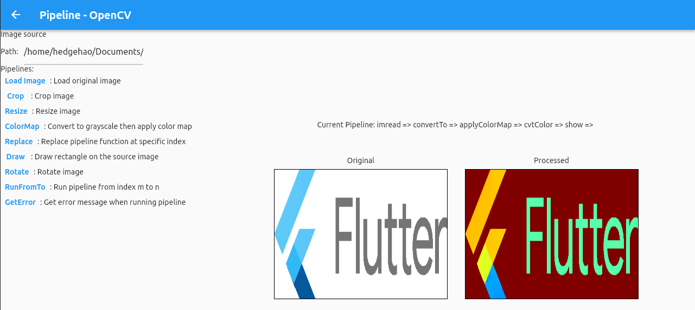
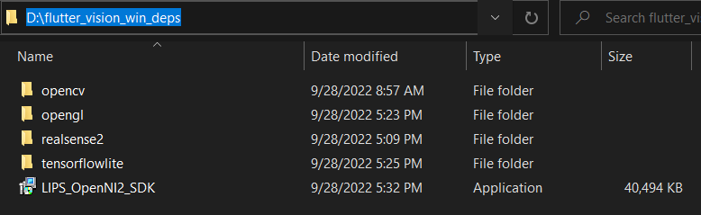
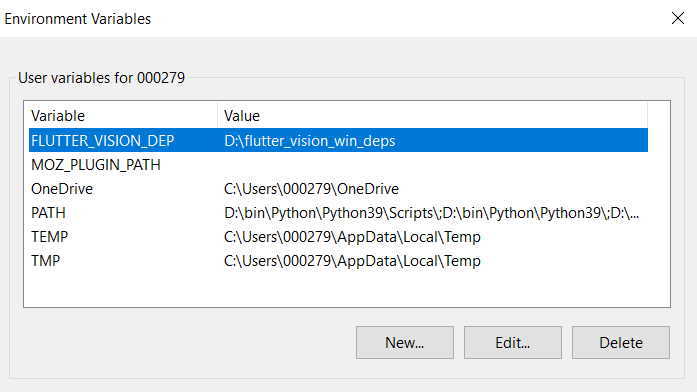
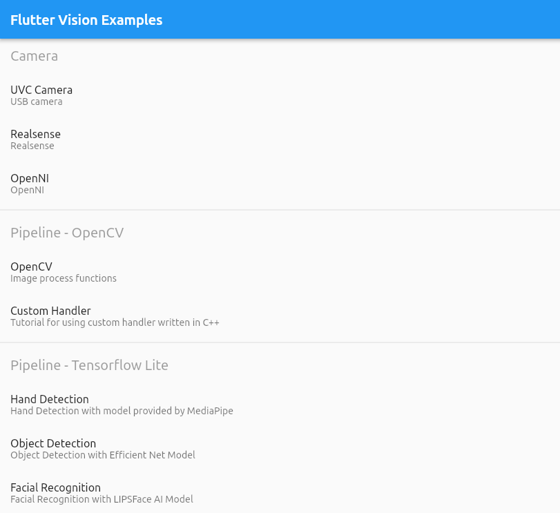

# Flutter Vision

A framework for 2D & 3D image processing with AI (Tensorflow Lite)

* 3D camera RGB, Depth, IR frames and PointCloud


* Capture image from camera and process with OpenCV and TensorflowLite hand recognition AI model.


* Process image by OpenCV functions

---
## Prerequisite
### Linux

* GLEW
* OpenCV 4.0.0+
* GLM
* gtk3
* Tensorflow Lite 2.7.0+
> All the dependency package can be installed using apt-get expect TensorFlow Lite. Please follow [documentation](https://www.tensorflow.org/install/source) to build `libtensorflowlite.so` and place it to where compiler can find (e.g /usr/lib/)

### Windows

1. Download dependency files from [here](https://reurl.cc/AOm1d8)

2. Extract downloaded file to where you like.



3. Add system environment variable `FLUTTER_VISION_DEP`



4. Execute and install `LIPS OpenNI2 SDK`

## Example App



The example app set all used TensorFlow Lite models in `example/lib/define.dart`. Please download the models. And modify this define file, set the correct path, if you want to run Tensorflow Lite pipeline example.

```dart
class Define {
  static const HAND_DETECTOR_MODEL = '/path/to/model';
  static const FACE_DETECTOR_MODEL = '/path/to/model';
  static const EFFICIENT_NET_MODEL = '/path/to/model';
}
```

| Example    |          Description              |
| ---------- | --------------------------------  |
| [Camera] UVC Camera | Display 2D USB camera video frame |
| [Camera] Realsense  | Display 3D camera RGB, depth, IR frames and PointCloud using Realsense SDK |
| [Camera] OpenNI     | Display 3D camera RGB, depth, IR frames and PointCloud using OpenNI2 SDK |
| [Pipeline] OpenCV | Load a image file. Use different pipeline functions to process this image |
| [Pipeline] Custom Handler | Load a image file. Use pipeline native handler(written in C++) to process this image |
| [Pipeline] Hand Detection | Load video from UVC camera. Use tensorflow lite pipeline functions to detect hand in frame. Hand detection model from [MediaPipe](https://storage.googleapis.com/mediapipe-assets/palm_detection_lite.tflite)|
| [Pipeline] Object Detection | Load video from UVC camera. Use tensorflow lite pipeline functions to recognize object in frame. Object detection model from [TensorflowLite](https://tfhub.dev/tensorflow/lite-model/efficientnet/lite4/fp32/2)|
| [Pipeline] Facial Recognition | Load video from UVC camera. Use tensorflow lite pipeline functions to detect face in frame. Facial Recognition Model from [LIPS Corp.](https://www.lips-hci.com/lipsface-3d-facial-recognition-solution)

## Supported 3D Camera
| Camera                | Supported | Tested | Product Link |
| --------------------- | --------- | ------ | ------------ |
| Intel Realsense D415  |     ✅    |   ✅   |  [Link](https://www.intelrealsense.com/depth-camera-d415/) |
| Intel Realsense D435  |     ✅    |   ✅   |  [Link](https://www.intelrealsense.com/depth-camera-d435/) |
| Intel Realsense D435i |     ✅    |        |  [Link](https://www.intelrealsense.com/depth-camera-d435i/) |
| Intel Realsense D455  |     ✅    |        |  [Link](https://www.intelrealsense.com/depth-camera-d455/) |
| Intel Realsense T265  |     ✅    |        |  [Link](https://www.intelrealsense.com/tracking-camera-t265/) |
| Intel Realsense L515  |     ✅    |        |  [Link](https://www.intelrealsense.com/lidar-camera-l515/) |
| LIPSedge AE400        |     ✅    |   ✅   |  [Link](https://www.lips-hci.com/lipsedge-ae400) |
| LIPSedge AE450        |     ✅    |   ✅   |  [Link](https://www.lips-hci.com/lipsedge-ae450) |
| LIPSedge DL           |     ✅    |   ✅   |  [Link](https://www.lips-hci.com/lipsedge-dl-series) |
| LIPSedge M3           |     ✅    |   ✅   |  [Link](https://www.lips-hci.com/lipsedge-m3-series) |
| LIPSedge L Series     |     ✅    |   ✅   |  [Link](https://www.lips-hci.com/lipsedge-l-series) |


## Usage
---
## 1. Create and Connect to Camera
* UVC Camera
```dart
UvcCamera? cam = await FvCamera.create(ctl.text, CameraType.UVC) as UvcCamera?;
```

* OpenNI2 Camera
```dart
OpenniCamera? cam = await FvCamera.create(ctl.text, CameraType.OPENNI) as OpenniCamera?;
```

* Realsense, LIPSedge AE400 and LIPSedge AE450
```dart
RealsenseCamera? cam = await FvCamera.create(ctl.text, CameraType.REALSENSE) as RealsenseCamera?;
```

* Virtual Camera (Load frame from file system without video stream)
```dart
DummyCamera? cam = await FvCamera.create(ctl.text, CameraType.DUMMY) as DummyCamera?;
```

---
## 2. Enable/Disable camera video stream
```dart
await cam.enableStream();
await cam.disableStream();
```
---
## 3. Bind texture widget
```dart
Texture(textureId: cam.rgbTextureId);
```
---
## 4. Pipeline (Set how to process frames captured from camera)
* Display UVC video stream
```dart
FvPipeline uvcPipeline = cam.rgbPipeline;
await uvcPipeline.cvtColor(OpenCV.COLOR_BGR2RGBA);
await uvcPipeline.show();
```

* Display 3D camera depth and IR frame with color map applied
```dart
FvPipeline depthPipeline = cam.depthPipeline;
await depthPipeline.convertTo(0, 255.0 / 1024.0);
await depthPipeline.applyColorMap(OpenCV.COLORMAP_JET);
await depthPipeline.cvtColor(OpenCV.COLOR_RGB2RGBA);
await depthPipeline.show();
```

* Object detection with Efficient Net (Tensorflow Lite)
```dart
// Create Tensorflow Lite Model
TFLiteModel model = await TFLiteModel.create('/path/to/model.tflite');

// Use pipeline to set input for model
FvPipeline rgbPipeline = cam!.rgbPipeline;
await rgbPipeline.setInputTensorData(model!.index, 0, FvPipeline.DATATYPE_UINT8);
await rgbPipeline.inference(model!.index);

// Set the callback function. Called when inference is done.
FlutterVision.listen((MethodCall call) async {
    if (call.method == 'onInference') {
        ...
    }
});
```
---
## APIs
```dart
// Enumberation
enum CameraType { OPENNI, REALSENSE, DUMMY, UVC }


// FlutterVision Functions
class FvCamera {
    static Future<FvCamera?> create(String serial, CameraType type)
    Future<void> close()
    Future<bool> enableStream()
    Future<bool> disableStream()
    Future<void> enablePointCloud()
    Future<void> disablePointCloud()
    Future<bool> isConnected()
    Future<void> configure(int prop, double value)
    Future<bool> screenshot(int index, String path, {int? cvtCode})
}

class OpenniCamera extends FvCamera {}
class RealsenseCamera extends FvCamera {}
class UvcCamera extends FvCamera {}

class FlutterVision {
    static listen(Future<dynamic> Function(MethodCall) callback)
    static Future<int> niInitialize()
    static Future<List<OpenNi2Device>> enumerateDevices()
    static Future<List<String>> rsEnumerateDevices()

    static Future<int> getOpenglTextureId()
    static Future<void> openglRender()
}

class FvPipeline {
    Future<void> clear()
    Future<void> cvtColor(int mode, {int? at, int? interval, bool? append})
    Future<void> imwrite(String path, {int? at, int? interval, bool? append})
    Future<void> imread(String path, {int? at, int? interval, bool? append})
    Future<void> show({int? at, int? interval, bool? append})
    Future<void> convertTo(int mode, double scale, {int? at, double? shift, int? interval, bool? append})
    Future<void> applyColorMap(int colorMap, {int? at, int? interval, bool? append})
    Future<void> resize(int width, int height, {int? at, int? mode, int? interval, bool? append})
    Future<void> crop(int xStart, int xEnd, int yStart, int yEnd, {int? at, int? interval, bool? append})
    Future<void> rotate(int rotateCode, {int? at, int? interval, bool? append})
    Future<void> cvRectangle(double x1, double y1, double x2, double y2, int r, int g, int b, {int? at, int? thickness, int? lineType, int? shift, int? alpha, int? interval, bool? append})
    Future<void> setInputTensorData(int modelIndex, int tensorIndex, int dataType, {int? at, int? interval, bool? append})
    Future<void> inference(int modelIndex, {int? at, int? interval, bool? append})
    Future<void> customHandler(int size, {int? at, int? interval, bool? append})
    Future<int> run({int? from, int? to})
}

class TFLiteModel{
    static Future<TFLiteModel> create(modelPath)

    Future<Float32List> getTensorOutput(int tensorIndex, List<int> size)
}
```

## Known Issues

* Tensorflow Lite model cannot load in debug mode on Windows. If you want to use tensorflow lite functions on Windows, run flutter app with release mode.